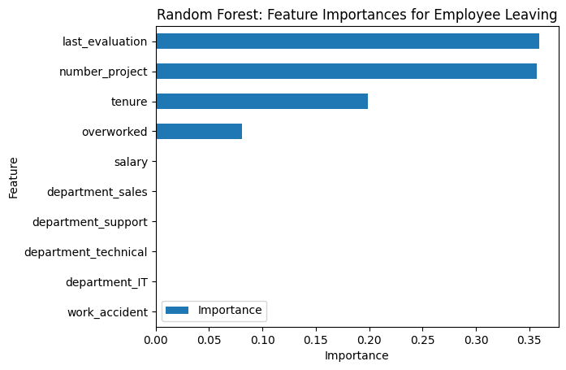

# Employee Attrition Analysis using Machine Learning for Salifort Motors

## Project Overview
This project aims to understand the factors leading to employee attrition in Salifort Motors and to provide actionable insights to retain employees. By analyzing a dataset of employee records, we built predictive models to identify key factors influencing attrition and recommend strategies to improve employee retention.

## Business Understanding
The primary stakeholders are the Human Resources department and company management. The business problem addressed is the high rate of employee attrition, which incurs significant costs in terms of recruitment, training, and lost productivity. Understanding the factors that lead to attrition allows the company to implement targeted strategies to retain valuable employees.

## Data Exploration
The dataset includes 11,991 entries of employee data with various attributes such as employee satisfaction, evaluation scores, number of projects, average monthly hours, years at the company, and other demographic information. The data covers a timeframe of several years, providing a comprehensive view of employee behavior and outcomes. Key visualizations, such as histograms and correlation matrices, were used to explore the data and identify initial patterns.

  Despite the imbalanced classes, Random Forest was chosen because it is an ensemble method that tends to be more robust to imbalances than simpler algorithms. The model's ability to handle a large number of features and to implicitly perform feature selection makes it suitable for this type of analysis.

## Modeling and Evaluation
Several models were used to predict employee attrition, including:
- Logistic Regression
- Tree Models
- **Random Forest Models**: Outperformed log regression the decision tree model in terms of accuracy and other metrics.

### **Random Forest Champion Model:**
  
This Random Forest model is designed to classify if an employee will leave the company. 
Best parameters:
- **max_depth: 5** – Limits tree depth to prevent overfitting.
- **max_features: 1.0** – Uses all features for splits.
- **max_samples: 0.7** – Trains on 70% of data for robustness.
- **min_samples_leaf: 2** – Ensures at least 2 samples per leaf.
- **min_samples_split: 2** – Requires 2 samples to split nodes.
- **n_estimators: 300** – Utilizes 300 trees for stability.

This setup balances complexity and generalization for effective attrition prediction.

### **Model Evaluation Metrics**

| Metric     | Score    |
|------------|----------|
| Precision  | 0.870406 |
| Recall     | 0.903614 |
| F1 Score   | 0.8867   |
| Accuracy   | 0.961641 |
| AUC        | 0.938407 |

  
  
The model predicts more false positives than false negatives, indicating that some employees may be incorrectly identified as at risk of quitting or being fired. Despite that it shows robust performance in validation and test data. 

### **Feature Importance**

  
  
The model highlighted that factors such as overwork, evaluation scores, and years at the company are significant predictors of attrition.

## Conclusion and Recommendations

The analysis provided several key insights into the reasons for employee attrition and led to the following recommendations for stakeholders:

- Limit the number of projects assigned to each employee.
- Promote employees who have been with the company for at least four years or address dissatisfaction among long-tenured employees.
- Compensate employees for extended working hours or reduce overtime requirements.
- Ensure clear communication of overtime pay policies and workload expectations.
- Conduct discussions to understand and improve the work culture.
- Implement a proportional reward system based on effort and contribution rather than excessive working hours.

Next steps include expanding the analysis to include more diverse datasets, refining the models, and exploring additional factors that may influence employee satisfaction and retention.

